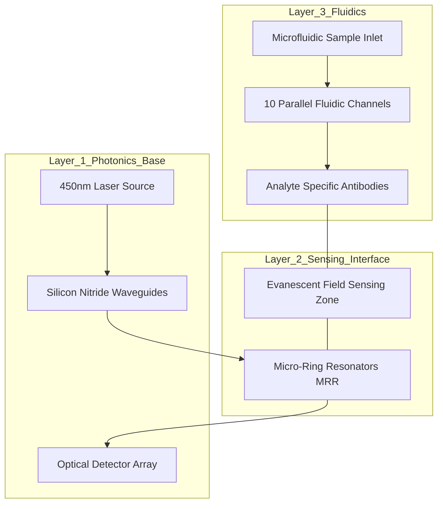

# BioSense LOC — Photonic Biosensor Diagnostic System

**BioSense LOC** is a state-of-the-art Lab-on-a-Chip (LOC) multiplexed pathogen detection platform. It leverages integrated photonics and microfluidics to identify up to 10 pathogens simultaneously in under 15 minutes.

---

## 🧬 The Core Concept
Traditional diagnostics take 24-48 hours. BioSense LOC reduces this to minutes by using the physics of light (Evanescent Field Sensing) to detect bacteria directly from a sample without chemical reagents.

### 🔬 How it Works (The Science)
1. **Sample Entry**: A 0.5 mL biofluid (blood/saliva) enters the microfluidic chip.
2. **Pathogen Capture**: Each of the 10 channels is coated with specific antibodies. Bacteria bind only to their matching channel.
3. **Photonics Transduction**: Light from a **450nm Blue Laser** travels through Silicon Nitride waveguides.
4. **Wavelength Shift**: As bacteria bind, the refractive index changes, causing a "Redshift" in the light's wavelength.
5. **AI Verification**: A neural model fits the data to **Langmuir Kinetic Curves** to confirm specific molecular binding and reject noise (bubbles/drift).

---

## 🛠️ Hardware Architecture

The system consists of a credit-card-sized disposable chip and a reusable optical reader.

### 1. The Photonic Chip (3D Layer Map)


### 2. Key Components
| Part | Material/Spec | Function |
| :--- | :--- | :--- |
| **Waveguides** | Silicon Nitride (Si3N4) | Channels light with ultra-low loss across the chip. |
| **Micro-Ring Resonators** | 10um Diameter Rings | Amplifies the light-matter interaction for high sensitivity. |
| **Evanescent Field** | ~200nm Projection | Specifically senses particles bound to the surface, ignoring dust. |
| **Microfluidic Inlet** | PDMS / Glass | Sorts and delivers the sample to the 10 detection lanes. |

---

## 🖥️ Software Architecture

The digital twin (this website) simulates the hardware response:

- **Frontend**: React + TanStack Router (Clinical UI)
- **Charts**: Recharts (Binding Kinetics & Spectrum)
- **Math Engine**: 
  - **Langmuir Adsorption Logic**: $θ(t) = (kC) / (1 + kC) * (1 - e^{-(kC + kd)t})$
  - **AI Rejection**: Exponential Moving Average (EMA) to filter mechanical spikes.

---

## 🚀 Deployment & Installation

### Prerequisities
- Node.js (v18+)
- NPM or Bun

### Steps
1. **Clone the repo**:
   ```bash
   git clone https://github.com/your-username/BioSense-LOC.git
   ```
2. **Install Dependencies**:
   ```bash
   npm install
   ```
3. **Run Dev Server**:
   ```bash
   npm run dev
   ```
4. **Build for Production**:
   ```bash
   npm run build
   ```

---

## 📊 Technical Mapping (AI Logic)
| Load Level | Wavelength Shift (Δλ) | Diagnostic Action |
| :--- | :--- | :--- |
| **Clear** | < 0.05 nm | No action required |
| **Moderate** | 0.2 - 0.5 nm | Retest recommended; monitor symptoms |
| **Critical (Sepsis)** | > 0.8 nm | Immediate Clinical Intervention required |

---
*Developed for Photonic Biosensor Research. Not for actual clinical diagnosis.*
